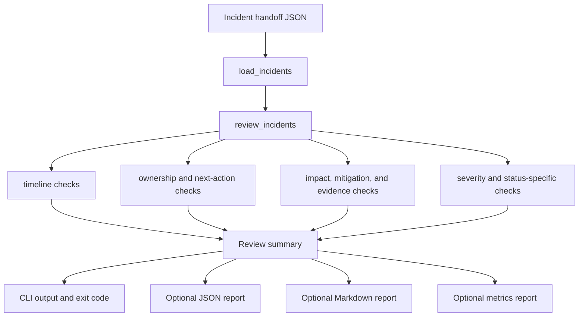

# Incident Handoff Readiness Check

A dependency-free Python CLI that reviews incident handoff notes before an on-call shift transfer or owner change.

## Problem

Incident handoffs often fail because the next owner gets a short status line instead of the operational context needed to continue safely. Missing timeline details, unclear impact, no next action, weak mitigation notes, or absent rollback plans can slow response and increase production risk.

This project turns those handoff expectations into a small deterministic check that can run locally, in a release checklist, or before a shift handoff.

## Features

- Validates incident handoff JSON files.
- Flags incomplete timelines, missing owners, missing impact summaries, and missing mitigations.
- Requires next update times and rollback plans for open incidents.
- Checks customer communication status for `sev1` and `sev2` incidents.
- Requires follow-up notes for closed incidents.
- Writes optional JSON, Markdown, and Prometheus-style reports for CI artifacts or reviewer packets.
- Returns clear exit codes for automation:
  - `0`: handoff is ready
  - `1`: handoff has readiness issues
  - `2`: input is invalid
- Includes safe and risky sample handoff files.
- Includes unit tests for the core validation behavior.

## Tech Stack

- Python 3.10+
- Python standard library only
- `unittest` for tests
- Docker for optional isolated execution

## Architecture



## Repository Structure

```text
.
|-- Dockerfile
|-- Makefile
|-- README.md
|-- docs
|   `-- CASE_STUDY.md
|-- incident_handoff_check.py
|-- pyproject.toml
|-- reports
|   |-- risky_handoff_metrics.prom
|   |-- risky_handoff_report.json
|   `-- risky_handoff_report.md
|-- samples
|   |-- risky_handoff.json
|   `-- safe_handoff.json
`-- tests
    `-- test_incident_handoff_check.py
```

## Setup

Clone the repo and run the CLI with Python 3.10 or newer:

```bash
git clone https://github.com/Nagadeepak1998/incident-handoff-readiness-check.git
cd incident-handoff-readiness-check
python3 --version
```

No third-party dependencies are required.

## Run The CLI

Check the passing sample:

```bash
python3 incident_handoff_check.py samples/safe_handoff.json
```

Expected output:

```text
PASS: incident handoff is ready for the next owner
```

Check the risky sample:

```bash
python3 incident_handoff_check.py samples/risky_handoff.json
```

Expected output starts with:

```text
FLAGGED: 11 incident handoff issue(s) detected
```

## Write Review Artifacts

The CLI can write machine-readable JSON, reviewer-friendly Markdown, and
Prometheus-style metrics without changing its exit-code behavior:

```bash
python3 incident_handoff_check.py samples/risky_handoff.json \
  --json-out reports/risky_handoff_report.json \
  --markdown-out reports/risky_handoff_report.md \
  --metrics-out reports/risky_handoff_metrics.prom || true
```

You can also use the bundled targets:

```bash
make test
make smoke
make report
```

The generated JSON includes status, incident count, finding count, severity
counts, owner coverage, and individual findings. The Markdown report is designed
for release notes, handoff reviews, or incident-readiness pull request comments.
The metrics output gives lightweight gauges and counters for dashboards or CI logs.

## Case Study

See `docs/CASE_STUDY.md` for the incident handoff scenario, design choices,
operational use, verification path, and limitations.

## Run With Docker

```bash
docker build -t incident-handoff-readiness-check .
docker run --rm incident-handoff-readiness-check samples/safe_handoff.json
```

To check your own handoff file:

```bash
docker run --rm -v "$PWD:/work" incident-handoff-readiness-check /work/path/to/handoff.json
```

## Tests

```bash
python3 -m py_compile incident_handoff_check.py tests/test_incident_handoff_check.py
PYTHONPATH=. python3 -m unittest discover -s tests
```

## Demo

```bash
python3 incident_handoff_check.py samples/safe_handoff.json
python3 incident_handoff_check.py samples/risky_handoff.json || true
python3 incident_handoff_check.py samples/risky_handoff.json \
  --json-out reports/risky_handoff_report.json \
  --markdown-out reports/risky_handoff_report.md \
  --metrics-out reports/risky_handoff_metrics.prom || true
```

The second command intentionally exits with `1` because the risky fixture is expected to be flagged.

## What This Demonstrates

- Production support thinking for incident ownership transfers.
- Practical SRE/DevOps readiness checks.
- Deterministic validation logic that can fit into lightweight automation.
- Clean CLI behavior with tests, fixtures, and review artifacts.
- Clear communication of operational risk without depending on external services.

## Future Improvements

- Support a configurable policy file for team-specific handoff rules.
- Add GitHub Actions CI once the publishing token includes `workflow` scope.
- Add richer schema validation while keeping the no-dependency default path.

## Scope

This is a local readiness checker, not an incident management platform. It does not connect to paging systems, ticketing systems, Slack, Teams, or production services.
