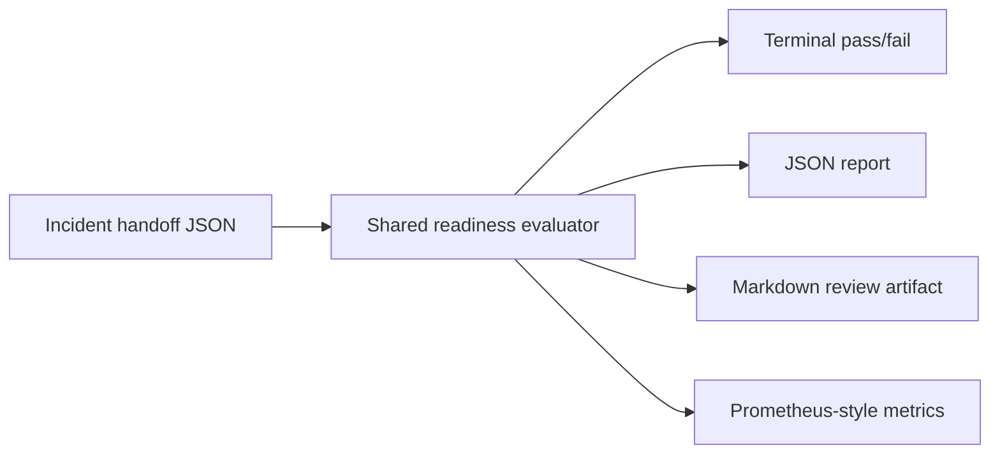

# Case Study: Incident Handoff Readiness Gate

## Scenario

An on-call engineer is transferring an active incident to another owner. The receiving
owner needs more than a short status line: they need impact, current mitigation, evidence,
customer communications state, next action, and rollback or fallback context.

## Design

The checker keeps the default path dependency-free so it can run from a laptop, Docker
container, or lightweight CI job. A single evaluator powers the terminal output plus JSON,
Markdown, and Prometheus-style metrics artifacts.



## Operational Use

- Run the gate before shift transfer or incident owner reassignment.
- Store the Markdown report with the incident ticket when the handoff is flagged.
- Ship the metrics file as a build artifact or scrape-compatible text snapshot.
- Keep the risky fixture as a deterministic regression case for readiness gaps.

## Verification

```bash
make test
make smoke
make report
```

`make smoke` expects the risky sample to exit with `1`. `make report` writes deterministic
artifacts under `reports/` and also exits through the expected flagged path.

## Limitations

- The project does not connect to paging, ticketing, chat, or production systems.
- It validates the shape and completeness of handoff notes, not whether the incident facts
  are true.
- The policy is intentionally fixed for portability; team-specific rules can be added later
  if they are grounded in real handoff requirements.
